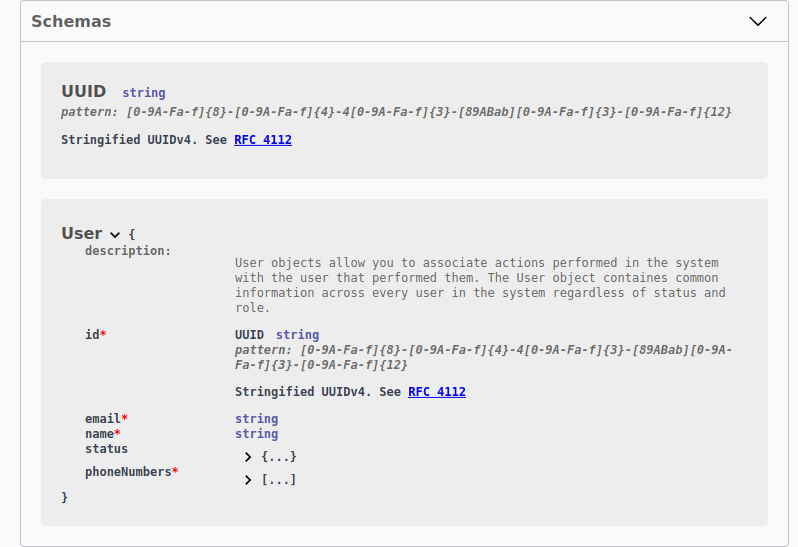

# Descriptions

While tsoa can extract a lot of information from your TypeScript type annotations, that can only get us so far in terms of documenting our code.
In order stay true to our efforts to avoid code duplication, tsoa uses JSDoc based annotations whenever we want to describe information which is not part of the type system.

::: tip
tsoa does not check if you provide descriptions.

We recommend using a linter
(we love [Spectral](https://stoplight.io/open-source/spectral)) to ensure your specifications aren't just correct,
but also contain descriptions and correct [examples](./examples).
:::

A great example for this are descriptions. You'd most likely agree that endpoint descriptions either in text or markdown are very helpful for consumers get a better sense of an API Endpoint through a short description as part of a rendered documentation.
But developers like you also benefit from JSDoc, which is often displayed directly in your editor when hovering over a method you may not be familiar with.
Spoiler: tsoa makes both of these things possible.

## Endpoint descriptions

One of the most helpful kind of descriptions are method descriptions, or, in HTTP terminology, endpoint descriptions.

```ts {3-6}
@Route("users")
export class UsersController extends Controller {
  /**
   * Retrieves the details of an existing user.
   * Supply the unique user ID from either and receive corresponding user details.
   */
  @Get("{userId}")
  public async getUser(
    @Path() userId: number,
    @Query() name?: string
  ): Promise<User> {
    return new UsersService().get(userId, name);
  }
}
```

By hovering over the name of the method, we can already see the result in our editor:


But that's only half of the benefit:


The OAS reflects this change as well, and so will the documentation rendered from that spec!

## Parameter descriptions

But why stop there? [JSDoc also offers parameter descriptions](https://jsdoc.app/tags-param.html), let's see that in action:

```ts {6,7}
@Route("users")
export class UsersController extends Controller {
  /**
   * Retrieves the details of an existing user.
   * Supply the unique user ID from either and receive corresponding user details.
   * @param userId The user's identifier
   * @param name Provide a username to display
   */
  @Get("{userId}")
  public async getUser(
    @Path() userId: number,
    @Query() name?: string
  ): Promise<User> {
    return new UsersService().get(userId, name);
  }
}
```

## Model descriptions

We can also render descriptions at the model level (models are interfaces or classes or type aliases):

```ts {1-6}
/**
 * User objects allow you to associate actions performed
 * in the system with the user that performed them.
 * The User object contains common information across
 * every user in the system regardless of status and role.
 */
export interface User {
  id: number;
  email: string;
  name: string;
  status?: "Happy" | "Sad";
  phoneNumbers: string[];
}
```

::: tip
With the introduction of Type Aliases in tsoa 3, you can use this as a very powerful pattern.
Let's assume for a second that our API handles Users identified by a UUID.
Usually, uuids are sent as strings, however, ideally, we want to make sure we say uuid when we want uuids.
That said, duplicating the description all over the code is a lot of effort, let's see how we can do better:

```ts {1,2,3,4,5}
/**
 * Stringified UUIDv4.
 * See [RFC 4112](https://tools.ietf.org/html/rfc4122)
 * @pattern [0-9A-Fa-f]{8}-[0-9A-Fa-f]{4}-4[0-9A-Fa-f]{3}-[89ABab][0-9A-Fa-f]{3}-[0-9A-Fa-f]{12}
 * @format uuid
 */
export type UUID = string;
```

<details>
<summary>We can reuse that in our User</summary>

```ts
/**
 * User objects allow you to associate actions performed in the system with the user that performed them.
 * The User object contains common information across every user in the system regardless of status and role.
 */
export interface User {
  id: UUID;
  email: string;
  name: string;
  status?: "Happy" | "Sad";
  phoneNumbers: string[];
}
```

</details>

Now, we define `UUID` as a reusable type alias.
Modern editors will nicely display the information text when we hover over references


tsoa will translate this to a reusable component that can be referenced every time you use that type alias:

<details>
<summary>OpenAPI Spec</summary>

```yaml
components:
  schemas:
    UUID:
      type: string
      description: "Stringified UUIDv4.\nSee [RFC 4112](https://tools.ietf.org/html/rfc4122)"
      pattern: "[0-9A-Fa-f]{8}-[0-9A-Fa-f]{4}-4[0-9A-Fa-f]{3}-[89ABab][0-9A-Fa-f]{3}-[0-9A-Fa-f]{12}"
    User:
      description: "User objects allow you to associate actions performed in the system with the user that performed them.\nThe User object contains common information across every user in the system regardless of status and role."
      properties:
        id:
          $ref: "#/components/schemas/UUID"
```

</details>

Which will look like like this when rendered:

<details>



</details>

<br>
:::

## Property descriptions

::: warning
You may expect to see a description for the `id` if you set one.
However, since it'll be transformed to a reference to the UUID schema, the description must be ignored,
since any properties that are placed next to _\$ref_ (OpenAPI's mechanism to link to the UUID schema) must be ignored.

For more info, check out the relevant parts of the [OpenAPI Specification](https://github.com/OAI/OpenAPI-Specification/blob/master/versions/3.0.3.md#schemaObject) and [JSON Schema Core](https://tools.ietf.org/html/draft-wright-json-schema-00#section-7)

:::

```ts {8,9,10}
/**
 * User objects allow you to associate actions performed in the system with the user that performed them.
 * The User object contains common information across every user in the system regardless of status and role.
 */
export interface User {
  id: UUID;

  /**
   * The email the user used to register his account
   */
  email: string;

  name: string;
  status?: "Happy" | "Sad";
  phoneNumbers: string[];
}
```

## Summaries

tsoa uses short descriptions provided via the JSDoc  annotation and will use it as the summary in the OpenAPI doc:

```ts {5}
  /**
   * A very long, verbose, wordy, long-winded, tedious, verbacious, tautological,
   * profuse, expansive, enthusiastic, redundant, flowery, eloquent, articulate,
   * loquacious, garrulous, chatty, extended, babbling description.
   * @summary A concise summary.
   */
  @Get('SummaryMethod')
  public async summaryMethod(): Promise<TestModel> {
    return new ModelService().getModel();
  }
```
