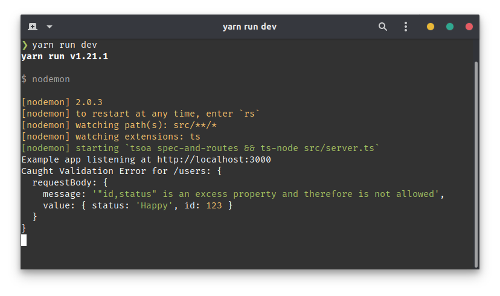

# Error Handling

::: warning COMPATIBILITY NOTE
This guide requires Node.js >= 8 and will target [express](https://expressjs.com).
We currently recommend using [Yarn](https://yarnpkg.com/en/), npm should work but was not tested.
This guide assumes you followed the [getting started guide]('/getting-started') or have a similar setup.
:::

As you may have noticed after following all the steps from the [getting started guide]('/getting-started'), our server does not allow for invalid parameters, but the response isn't very ideal yet.


For the Client, it looks something like this:


## Setting up error handling

### Handling Validation Errors

Let's first make sure that, whenever the Client triggers a Validation Error, instead of printing the stack trace, instead we show a properly formatted json response.

At the end of our `app.ts`, after the call to `RegisterRoutes(app)`, we'll add a global express error handler:

```ts
import express, {
  Response as ExResponse,
  Request as ExRequest,
  NextFunction,
} from "express";
import { ValidateError } from 'tsoa';
// ...

app.use(function errorHandler(
  err: unknown,
  req: ExRequest,
  res: ExResponse,
  next: NextFunction
): ExResponse | void {
  if (err instanceof ValidateError) {
    console.warn(`Caught Validation Error for ${req.path}:`, err.fields);
    return res.status(422).json({
      message: "Validation Failed",
      details: err?.fields,
    });
  }
  if (err instanceof Error) {
    return res.status(500).json({
      message: "Internal Server Error",
    });
  }

  next();
});
```

Now, the same request will respond like this:


Additionally, our console will show:



### Handling missing routes

In order to handle missing urls more gracefully, we can add a "catch-all" route handler:

```ts
// app.ts
import express, {
  Response as ExResponse,
  Request as ExRequest,
  NextFunction,
} from "express";

// ...

RegisterRoutes(app)

app.use(function notFoundHandler(_req, res: ExResponse) {
  res.status(404).send({
    message: "Not Found",
  });
});


app.use(function errorHandler(
// ...
```

## Specifying error response types for OpenAPI

If you check out the Documentation endpoint, you'll notice that we don't have any documentation for our Errors yet.
Since TypeScript does not check throwing Errors, tsoa can't infer the type of response we're sending out in these cases.

::: warning
Please note that `@Response` has to be the tsoa import and can not currently be renamed
(i.e. `import {Response as TsoaResponse} from "tsoa"`)
:::

However, we have a way for you to manually specify these returns:

```ts
import { Body, Controller, Post, Route, Response, SuccessResponse } from "tsoa";
import { User } from "./user";
import { UsersService, UserCreationParams } from "./usersService";

interface ValidateErrorJSON {
  message: "Validation failed";
  details: { [name: string]: unknown };
}

@Route("users")
export class UsersController extends Controller {
  // more code here

  @Response<ValidateErrorJSON>(422, "Validation Failed")
  @SuccessResponse("201", "Created") // Custom success response
  @Post()
  public async createUser(
    @Body() requestBody: UserCreationParams
  ): Promise<void> {
    this.setStatus(201); // set return status 201
    new UsersService().create(requestBody);
    return;
  }
}
```

This should make our docs show something like this:


::: tip
OpenAPI allows matching status codes such as '2xx' or matching all codes using 'default'. tsoa will support this:

```ts
@Response<ErrorResponse>('default', 'Unexpected error')
@Get('Response')
public async getResponse(): Promise<TestModel> {
  return new ModelService().getModel();
}
```

:::

## Typechecked alternate responses

::: warning
This section applies to tsoa >=3.1
:::

In recent versions of tsoa, we have the option to inject a framework-agnostic responder function into our function that we can call to formulate a response that does not comply with the return type of our controller method/status code and headers (which is used for the success response).
This is especially useful to reply with an error response without the risk of type mismatches associated with throwing errors.
In order to inject one/more responders, we can use the `@Res()` decorator:

```ts
import { Route, Controller, Get, Query, Res, TsoaResponse } from 'tsoa'

@Route('/greeting')
export class GreetingsController extends Controller {
  /**
   * @param notFoundResponse The responder function for a not found response
   */
  @Get('/')
  public async greet(@Query() name?: string, @Res() notFoundResponse: TsoaResponse<404, { reason: string }>): Promise<string> {
    if (!name) {
      return notFoundResponse(404, { reason: "We don't know you yet. Please provide a name" });
    }

    return `Hello, ${name}`;
  }
```
