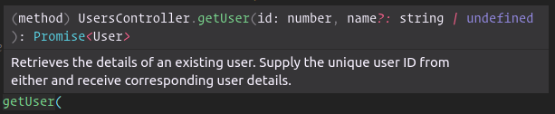

# Augmenting Code using JSDoc (Extensions)

While tsoa can extract a lot of information from your TypeScript type annotations, that can only get us so far in terms of documenting our Code.
In order stay true to our efforts to avoid code duplication, tsoa uses JSDoc based annotations whenever we want to describe information which is not part of the type system.

::: tip
tsoa does not check your descriptions and examples.

We recommend using a linter
(we love [Spectral](https://stoplight.io/p/docs/gh/stoplightio/spectral)) to ensure your specifications aren't just correct,
but also contain descriptions and correct examples.
:::

## Descriptions

A great example for this are descriptions. You'd most likely agree that endpoint descriptions either in text or markdown are very helpful for consumers get a better sense of an API Endpoint through a short description as part of a rendered documentation.
But developers like you also benefit from JSDoc, which is often displayed directly in your editor when hovering over a method you may not be familiar with.
Spoiler: tsoa makes both of these things possible.

### Endpoint descriptions

One of the most helpful kind of descriptions are method descriptions, or, in HTTP terminology, endpoint descriptions.

```ts {3-6}
@Route("users")
export class UsersController extends Controller {
  /**
   * Retrieves the details of an existing user.
   * Supply the unique user ID from either and receive corresponding user details.
   */
  @Get("{userId}")
  public async getUser(
    @Path() userId: number,
    @Query() name?: string
  ): Promise<User> {
    return new UserService().get(userId, name);
  }
}
```

By hovering over the name of the method, we can already see the result in our editor:



But that's only half of the benefit:


The OAS reflects this change as well, and so will the documentation rendered from that spec!

### Parameter descriptions

But why stop there? [JSDoc also offers parameter descriptions](https://jsdoc.app/tags-param.html), let's see that in action:

```ts {6,7}
@Route("users")
export class UsersController extends Controller {
  /**
   * Retrieves the details of an existing user.
   * Supply the unique user ID from either and receive corresponding user details.
   * @param userId The user's identifier
   * @param name Provide a username to display
   */
  @Get("{userId}")
  public async getUser(
    @Path() userId: number,
    @Query() name?: string
  ): Promise<User> {
    return new UserService().get(userId, name);
  }
}
```

### Model descriptions

We can also render descriptions at the model level (models are interfaces or classes or type aliases):

```ts {1-6}
/**
 * User objects allow you to associate actions performed
 * in the system with the user that performed them.
 * The User object contains common information across
 * every user in the system regardless of status and role.
 */
export interface User {
  id: number;
  email: string;
  name: string;
  status?: "Happy" | "Sad";
  phoneNumbers: string[];
}
```

::: tip
With the introduction of Type Aliases in tsoa 3, you can use this as a very powerful pattern.
Let's assume for a second that our API handles Users identified by a UUID.
Usually, uuids are sent as strings, however, ideally, we want to make sure we say uuid when we want uuids.
That said, duplicating the description all over the code is a lot of effort, let's see how we can do better:

```ts {1,2,3,4,5}
/**
 * Stringified UUIDv4.
 * See [RFC 4112](https://tools.ietf.org/html/rfc4122)
 * @pattern [0-9A-Fa-f]{8}-[0-9A-Fa-f]{4}-4[0-9A-Fa-f]{3}-[89ABab][0-9A-Fa-f]{3}-[0-9A-Fa-f]{12}
 */
export type UUID = string;
```

<details>
<summary>We can reuse that in our User</summary>

```ts
/**
 * User objects allow you to associate actions performed in the system with the user that performed them.
 * The User object contains common information across every user in the system regardless of status and role.
 */
export interface User {
  id: UUID;
  email: string;
  name: string;
  status?: "Happy" | "Sad";
  phoneNumbers: string[];
}
```

</details>

Now, we define `UUID` as a reusable type alias.
Modern editors will nicely display the information text when we hover over references


tsoa will translate this to a reusable component that can be referenced every time you use that type alias:

<details>
<summary>OpenAPI Spec</summary>

```yaml
components:
  schemas:
    UUID:
      type: string
      description: "Stringified UUIDv4.\nSee [RFC 4112](https://tools.ietf.org/html/rfc4122)"
      pattern: "[0-9A-Fa-f]{8}-[0-9A-Fa-f]{4}-4[0-9A-Fa-f]{3}-[89ABab][0-9A-Fa-f]{3}-[0-9A-Fa-f]{12}"
    User:
      description: "User objects allow you to associate actions performed in the system with the user that performed them.\nThe User object contains common information across every user in the system regardless of status and role."
      properties:
        id:
          $ref: "#/components/schemas/UUID"
```

</details>

Which will look like like this when rendered:

<details>


</details>

</br>
:::

### Property descriptions

::: warning
You may expect to see a description for the `id` if you set one.
However, since it'll be transformed to a reference to the UUID schema, the description must be ignored,
since any properties that are placed next to _\$ref_ (OpenAPI's mechanism to link to the UUID schema) must be ignored.

For more info, check out the relevant parts of the [OpenAPI Specification](https://github.com/OAI/OpenAPI-Specification/blob/master/versions/3.0.3.md#schemaObject) and [JSON Schema Core](https://tools.ietf.org/html/draft-wright-json-schema-00#section-7)

:::

```ts {8,9,10}
/**
 * User objects allow you to associate actions performed in the system with the user that performed them.
 * The User object contains common information across every user in the system regardless of status and role.
 */
export interface User {
  id: UUID;

  /**
   * The email the user used to register his account
   */
  email: string;

  name: string;
  status?: "Happy" | "Sad";
  phoneNumbers: string[];
}
```

## Examples

Study after study shows that examples are a crucial part of learning new APIs ([1](https://www.cs.mcgill.ca/~martin/papers/software2009a.pdf), [2](https://sigdoc.acm.org/cdq/how-developers-use-api-documentation-an-observation-study/), [3](https://ase.cpsc.ucalgary.ca/wp-content/uploads/2018/05/A-Study-of-the-Effectiveness-of-Usage-Examples-in-REST-API-Documentation.pdf)).
While certain issues, like type mismatches can be avoided by inferring examples from the JSON Schema (like the examples SwaggerUI automatically generates\*), it's often a lot more intuitive if we provide certain examples ourselves.

\* Which is limited as well, i.e. patterns will be ignored, and just sending the string "string" every time is somewhat suboptimal if that string actually carries meaning.

::: warning
OpenAPI 2 only allows one example per model/property/parameter. Although OpenAPI 3 supports multiple examples, tsoa does not support this behavior yet.
If this is something you want to see or need, we'd love to receive a PR for that.
:::

::: tip
tsoa does not (yet) check your examples.
Incorrect examples will not break your compilation, because OpenAPI [explicitly allows anything](https://github.com/OAI/OpenAPI-Specification/blob/master/versions/3.0.3.md#fixed-fields-20).
You may also just want to demonstrate tsoa's validation :smirk:

However, if you'd want to improve that by logging warnings, tsoa would love to see a PR for this.
For now, we recommend using a linter
(we love [Spectral](https://stoplight.io/p/docs/gh/stoplightio/spectral)) to ensure your specifications aren't just correct,
but also contain descriptions and correct examples.
:::

### Parameter examples

::: warning
You may expect to see an example for a type reference (to a type alias, interface or a class) if you set one.
However, since it'll be transformed to a reference (_\$ref_) to the schema, the example must be ignored,
since any properties that are placed next to _\$ref_ (OpenAPI's mechanism to link to the UserCreationParams schema) must be ignored.

For more info, check out the relevant parts of the [OpenAPI Specification](https://github.com/OAI/OpenAPI-Specification/blob/master/versions/3.0.3.md#schemaObject) and [JSON Schema Core](https://tools.ietf.org/html/draft-wright-json-schema-00#section-7)

:::

```ts {4}
@Route("users")
export class UsersController extends Controller {
  /**
   * @example userId "52907745-7672-470e-a803-a2f8feb52944"
   */
  @Get("{userId}")
  public async getUser(
    @Path() userId: UUID,
    @Query() name: string
  ): Promise<User> {
    return new UserService().get(userId, name);
  }
}
```

### Model examples

```ts {5,14-18}
/**
 * Stringified UUIDv4.
 * See [RFC 4112](https://tools.ietf.org/html/rfc4122)
 * @pattern [0-9A-Fa-f]{8}-[0-9A-Fa-f]{4}-4[0-9A-Fa-f]{3}-[89ABab][0-9A-Fa-f]{3}-[0-9A-Fa-f]{12}
 * @example "52907745-7672-470e-a803-a2f8feb52944"
 */
export type UUID = string;

/**
 * User objects allow you to associate actions performed in the system with the user that performed them.
 * The User object contains common information across every user in the system regardless of status and role.
 *
 *
 * @example {
 *  "id": "52907745-7672-470e-a803-a2f8feb52944",
 *  "name": "John Doe",
 *  "phoneNumbers": []
 * }
 */
export interface User {
  id: UUID;

  /**
   * The email the user used to register his account
   */
  email?: string;

  name: string;
  status?: "Happy" | "Sad";
  phoneNumbers: string[];
}
```

### Property examples

::: warning
You may expect to see an example for the `id` if you set one.
However, since it'll be transformed to a reference to the UUID schema, the example must be ignored,
since any properties that are placed next to _\$ref_ (OpenAPI's mechanism to link to the UUID schema) must be ignored.

For more info, check out the relevant parts of the [OpenAPI Specification](https://github.com/OAI/OpenAPI-Specification/blob/master/versions/3.0.3.md#schemaObject) and [JSON Schema Core](https://tools.ietf.org/html/draft-wright-json-schema-00#section-7)

:::

```ts {11-13}
export interface User {
  id: UUID;

  /**
   * The email the user used to register his account
   */
  email?: string;

  name: string;

  /**
   * @example "Happy"
   */
  status?: "Happy" | "Sad";

  phoneNumbers: string[];
}
```

### Response examples

Most likely, this will be a type reference to a type defined somewhere else.
You should set the example there, since the type reference will be be transformed to schema reference (using _\$ref_), and the example must be ignored,
since any properties that are placed next to _\$ref_ (OpenAPI's mechanism to link to the schema) must be ignored.

For more info, check out the relevant parts of the [OpenAPI Specification](https://github.com/OAI/OpenAPI-Specification/blob/master/versions/3.0.3.md#schemaObject) and [JSON Schema Core](https://tools.ietf.org/html/draft-wright-json-schema-00#section-7)

## JSON Schema Keywords

Under the hood, OpenAPI heavily relies on JSON Schema Draft 00 for all the data model specifications.
JSON Schema Draft 00 defines data types that are not implemented in TypeScript.
A great example are integers.
If we want to communicate that a number must be an integer,
tsoa will specify this in the OAS and validate incoming requests against that.

::: warning
As always, _\$ref_ restrictions apply
:::

In general, the JSDoc notation is very similar each time:

```
@<tsoaKeyword> <argument>* <rejectionMessage>?
```

::: tip
For parameters, use the `@<tsoaKeyword> <paramName> <argument>* <rejectionMessage>?` syntax in your JSDoc (similar to [descriptions](#parameter-descriptions) or [examples](#parameter-examples))
:::

Examples:

`@isInt we would kindly ask you to provide a number here`

`@minLength 1 array must not be empty`

`@maximum headerParameter 4 number must be <4`

### List of supported keywords (with arguments)

[Click here for the list of keywords supported by OpenAPI 3](https://github.com/OAI/OpenAPI-Specification/blob/master/versions/3.0.3.md#properties)

#### Generic

- default
- format

::: danger
Formats will generally not validated, except for `format: date(time)`, which will automatically be generated for TS type `Date`.
:::

#### Date

- isDateTime
- isDate
- minDate
- maxDate

#### Numeric

- **isInt (tsoa special since TS does not know integer as a type)**
- **isFloat (tsoa special since TS does not know integer as a type)**
- minimum
- maximum

#### String

- isString for setting custom error messages
- minLength
- maxLength
- pattern

#### Array

- isArray for setting custom error messages
- minItems
- maxItems
- unique

#### Boolean

- isBool for setting custom error messages
